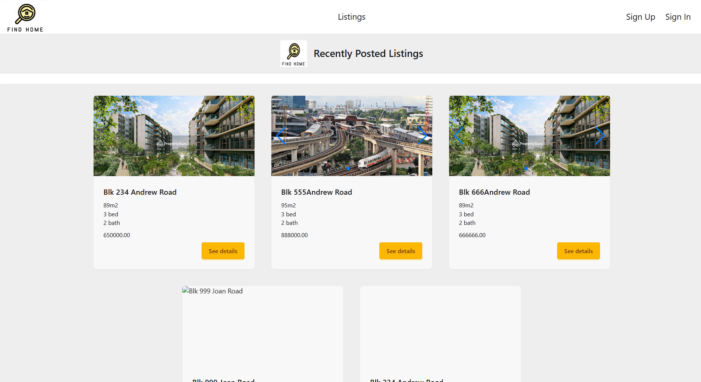

# FindHome

GitHub Repo: https://github.com/Joanne-000/FindHome.git  
Deployment: https://findhomeproperty.netlify.app/

FindHome
is a full-stack property listing web application that allows users to browse, view, and manage real estate listings. Visitors can explore available properties, view details and images, and inquire about listings. Registered users can sign up, log in, save their favorite properties, and manage their profile.

 

**MVP - Minimum Viable Product**

- A full-stack application (PERN).
- Implement JWT token-based authentication
- At least 2 types of users roles, e.g. admin, vendor, client, etc.
- Authorization is implemented across the front-end and back-end
- The project has full CRUD functionality on both the back-end and front-end.
- Appropriately store and access secret keys.
- Back-end application follows RESTful routing conventions

## Timeframe

2 weeks

## Technologies & Tools Used

- PERN (PostgreSQL, Express JS, React JS, Node JS)
- JSON Web Token (JWT) Authentication
- BCrypt for Password Encryption
- Tailwind CSS and Daisy UI
- TanStack Query
- React Router
- Axios
- Git & GitHub
- Beekeeper Studio
- Bruno
- Netlify for frontend deployment
- Render for backend deployment

## User Stories

### Home Page 

 

### Public Views (Guest):

- As an User (AAU), I can view all the listings with details and photos
- AAU, I can search or filter the listings based on keywords or price
- AAU, I can click to view the details of the listings with map location

### User Login (Agent & Buyer)

#### Buyer

- As an Buyer (AAB), I can save the listings as my favourites
- AAB, I can see my favourited listings in the list or on the map

#### Agent

- As an Agent (AAA), I can upload my listings with details and photos
- AAA, I can see all my listings in the list or on the map
- AAA, I can edit, delete and/or mark as sold any of the listings.
- AAA, I can save the listings as my favourites
- AAA, I can see my favourited listings in the list or on the map
- AAA, I want to see which user has registered interest on which of my listing

## Route planning / Tree Structure of Pages/Components

 

## Project Wireframes

Display All Listings Page  
 

Display One Listing Page  
 

## Future Enhancement

- Implement map display features to show the listings on map
- Implement premium user subscribe system for Agent to pin their listings on the main page
- Implement bot system to help to search the most relevant listings based on the keywords

## References:

#### TanStack Query References:

- https://tanstack.com/query/latest/docs/framework/react/overview

#### Axios References:

- https://axios-http.com/docs/api_intro

#### Tailwind CSS & Daisy UI References:

- https://tailwindcss.com/docs/installation/using-vite
- https://daisyui.com/docs/use/

#### Playwright References:

- https://playwright.dev/docs/api/class-test

#### Other References:

- https://npmdoc.github.io/node-npmdoc-bcrypt/build..beta..travis-ci.org/apidoc.html#apidoc.element.bcrypt.compare
- https://www.geeksforgeeks.org/sql/how-to-update-multiple-columns-in-single-update-statement-in-sql/
- https://github.com/TanStack/query/discussions/6101
- https://tkdodo.eu/blog/mastering-mutations-in-react-query#mutations-only-take-one-argument-for-variables
- https://tkdodo.eu/blog/react-query-and-type-script#what-about-error
- https://www.freecodecamp.org/news/object-object-in-javascript-meaning-in-js/
- https://developer.mozilla.org/en-US/docs/Web/JavaScript/Reference/Global_Objects/JSON/stringify?utm_source=chatgpt.com
- https://neon.com/docs/data-types/uuid
- https://stackoverflow.com/questions/75371048/select-option-in-usequery-in-react-query
- https://swiperjs.com/react#usage
